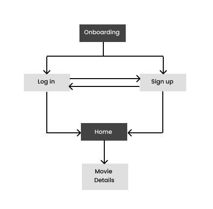
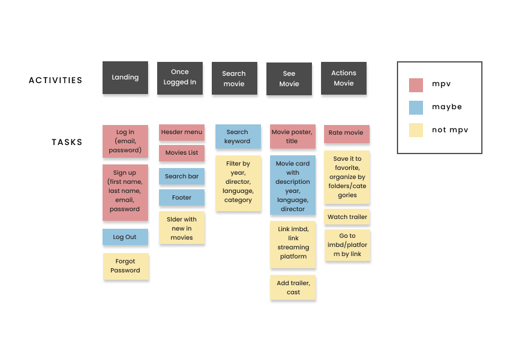

## Description

Filmic is a movie website searcher where the user can find all the information about a movie, organize and rate it.

## Ideation

**Challenge**

- Streaming platforms don't have all the movies in their programs.

- Movie searchers don't allow you to organize and save your movies.

- You cannot always remember if you liked or dislike a movie and what you loved or hated about it.

**Solutions**

- It allows you to look among all existing movies.

- Save your favorite movies and organize them by category.

- Rate and keep a record of all your ratings and reviews.

- Know in which streaming platform you can watch that movie.

  

## User Navigation Flow

## User Stories

- **sign up**: As a user I want to sign up in order to create an account

- **log in**: As a user I want to have access to my account

- **home/movies**: As a user I want to be able to see all the movies

- **movie Details:** As a user i want to know more about the film and rate it

## Wireframes low fidelity

## MPV

- Sign up

- Log in

- Movies display

- Rating

- Responsive Design

## Backlog

- Add favorites page

- Save/organize movies by categories

- Add movie streaming platform and imbd link
- Filter and sort search results
- Show new in and most popular films in slider
- Allow the user to access his account and change password